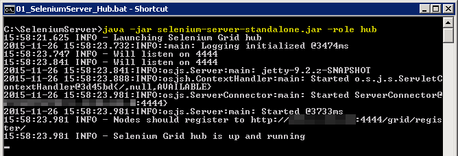

HOW TO - Robot Framework & Selenium (Grid) Server
=================================================
Learn how to set up a Selenium (Grid) Server and how to use it with the Robot Framework.


## Why should you want to set up a Remote Selenium Server?
>By using a Selenium Server on a remote or virtual machine, you avoid start up a browser and run tests on your local machine so you can continue working local while test execution is taking place remotely. Moreover, you easily can integrate test execution into Continuous Integration (CI) with e.g. Jenkins. *For more details about Selenium Server go to dedicated SeleniumHQ Github [page[3]](https://github.com/SeleniumHQ/selenium/wiki/Grid2)*.

# Table of Content
- [1. Prerequisites](#1-prerequisites)
- [2. Set Up Steps](#2-set-up-steps)
- [3. Usage](#3-usage)
- [4. References](#4-references)

# 1. Prerequisites
- Virtual Machine (VM) or remote desktop machine (RD) with Java (JRE) and Google Chrome browser installed
- Selenium Server Standalone [JAR[1]](http://www.seleniumhq.org/download)
- [ChromeDriver[2]](https://sites.google.com/a/chromium.org/chromedriver/downloads) to enable Selenium to drive Google Chrome 
- [optional] Webdriver for additional browsers (IE, PhantomJS, etc.) if you want to use more than just Firefox or Chrome
- Python + Robot Framework + Selenium2Library installed on your local machine

# 2. Set Up Steps
Follow exactly this steps to get a Selenium Server up and running:

1. Log on to your VM or RD and download Selenium Server Standalone JAR [HERE[1]](http://www.seleniumhq.org/download).
Place it in a folder where you can quickly find it e.g. `C:\SeleniumServer`
2. Open command line tool of your choice e.g. `CMD` and `CD` into the folder where you placed the JAR and run
`java -jar selenium-server-standalone.jar -role hub`
to start a Selenium hub which will manage our nodes (for details go [here](https://github.com/SeleniumHQ/selenium/wiki/Grid2)). Your should see some output like this:

  

3. Open another CMD window and `CD` again into the folder where the JAR is located and run
`java -jar selenium-server-standalone.jar -role node -hub http://localhost:4444/grid/register`
to start a node which our test will be executed on later. You should see some output like this:

   

4. That´s it. Selenium Server is up and running.
5. Now let´s check if we have done everything right. In a browser on your local machine go to `http://hostname:4444/grid` where 'hostname' is the name of your VM or RD. You should see something like that:

   

  When you click on link `view config` you should see this:

   


# 3. Usage
Make `simpletest.robot` file with this content:

```robot
*** Settings ***
| Library | Selenium2Library

*** Variables ***
| ${URL} | http://www.google.com

*** Test Cases ***
| Simple Test
| | Open Remote Chrome  

*** Keywords ***
| Open Remote Chrome 
| | [Documentation]  | Open Remote Browser
| | ${options}=      | Evaluate    | sys.modules['selenium.webdriver'].ChromeOptions() | sys
| | Call Method      | ${options}  | add_argument | --user-data-dir\=C:/Users/USERXY/AppData/Local/Google/Chrome/User Data
| | ${options}       | Call Method | ${options} | to_capabilities
| | Create WebDriver | Remote      | command_executor=http://HOSTNAME:4444/wd/hub | desired_capabilities=${options}
| | Go To | ${url}
```

In that file
- change `USERXY` to your current user´s folder name (it´s the user you are logged on with)
- change `HOSTNAME` to your current VM´s or RD´s hostname

On CMD or shell `CD` into the folder where `simpletest.robot` is placed and run:

`pybot simpletest.robot` to execute this little test. Notice how a Chrome browser is startet on your VM or RD and the test is executed there.

# 4. References
[1] http://www.seleniumhq.org/download

[2] https://sites.google.com/a/chromium.org/chromedriver/downloads

[3] https://github.com/SeleniumHQ/selenium/wiki/Grid2