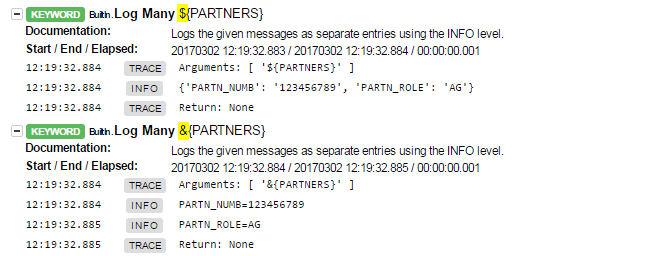

# How To use Robot Framework dict (dictionary) variables

### Creating a dictionary

> Notice that there's no real difference between using

    ${dict} =    Create Dictionary    name=value    second=2

and

    &{dict} =    Create Dictionary    name=value    second=2

The difference between `${dict}` and `&{dict}` in this usage is that
in the latter case Robot Framework converts the return value into a
special dictionary allowing key access like `${dict.name}` similarly
as when [creating dictionary variables][1] in the variable table.
`Create Dictionary` already returns such a special dictionary so in
this case there's no difference. With keywords that return normal
dictionaries the actual saved variable will be different depending on
do you assign to `${var}` or `&{var}`.


### Using a dictionary

There is, however, a big difference when you use a dictionary
depending on do you use

    Keyword    ${dict}

or

    Keyword    &{dict}

In the former case the keyword gets a single argument which is the
dictionary itself. The latter is equivalent to calling the keyword
with all the dictionary items as [named arguments][2] like

`Keyword    name=value    second=2`

Notice that you can use any dictionary like `&{var}` regardless how
the dictionary was initially created. Internally Robot Framework (2.9
and newer) stores all the variables in a single namespace regardless
are they created as scalars, lists or dictionaries.

### RF example code

Save below code into a `.robot` file (e.g. `dict.robot`) and exectue it (`robot -L TRACE dict.robot`).
Then analyse `log.html` to actually see the difference betwenn `${dict}` and `&{dict}`

```robotframework
# -*- coding: utf-8 -*-

*** Settings ***
Library    DateTime


*** Variables ***

# dictionary (dict)
&{PARTNERS}  
...  PARTN_NUMB=123456789
...  PARTN_ROLE=AG

# dict
&{SCHEDULES}
...  REQ_QTY=1

# list with a dict as content
@{ORDER_PARTNERS}    ${PARTNERS}
# same as above
@{ORDER_PARTNERS_2}  &{PARTNERS}

# list with a dict as content
@{ORDER_SCHEDULES}   ${SCHEDULES}

# list of dicts
@{DICT_COLLECTION}   ${PARTNERS}  ${SCHEDULES}

# list of lists with dicts
@{MEGA_LIST}         @{ORDER_PARTNERS}  @{ORDER_SCHEDULES}
...                  ${PARTNERS}  ${SCHEDULES}  @{DICT_COLLECTION}


*** Test Cases ***
LOGGING DICTIONARY VARIABLES

    # logging our dict
    log         ${PARTNERS}
    log         ${PARTNERS.PARTN_NUMB}
    log         &{PARTNERS}[PARTN_NUMB]
    log many    ${PARTNERS}
    log many    &{PARTNERS}
    # Log         &{PARTNERS}   # NO! This does't work!
                                # "Keyword 'BuiltIn.Log' expected 1 to 5 arguments, got 0"

    # logging list of dicts
    log         ${DICT_COLLECTION}
    log many    ${DICT_COLLECTION}
    log many    @{DICT_COLLECTION}
    # log         @{DICT_COLLECTION}  NO! Fails with AttributeError: upper
    
    # logging our mega list
    log many    @{MEGA_LIST}
    log many    ${MEGA_LIST}

    &{SCHEDULES}=  Create Dictionary
        ...  QUANTITY=3
        ...  DATE=123456

    # log         &{SCHEDULES}  # NO! this does not work!
                                # Fails with "Keyword 'BuiltIn.Log' expected 1 to 5 arguments, got 0"
    log          ${SCHEDULES}
    log many     ${SCHEDULES}
    log many     &{SCHEDULES}

    ${schedu}=   Evaluate  $SCHEDULES
    ${schedud}=  Evaluate  $SCHEDULES.DATE
    log          ${schedu}
    log          ${schedud}
    log          &{SCHEDULES}[DATE]
    # same as above BUT notice how $ vs & is used!!!
    log          ${SCHEDULES.DATE}

    # changing content inside dict
    ${date}=    Evaluate  datetime.date(2016,10,31)  modules=datetime
    log         ${date}
    ${SCHEDULES.DATE}=  Set Variable  ${date}
    log         ${SCHEDULES.DATE}
    ${SCHEDULES.DATE}=  Evaluate  datetime.date(2016,10,31)  modules=datetime
    log         ${SCHEDULES.DATE}
    log many    &{SCHEDULES}
    log many    @{ORDER_SCHEDULES}

    @{ORDER_SCHEDULES}    Create List    ${SCHEDULES}
    log many    @{ORDER_SCHEDULES}

```

### Log.html



See also [according Google Group discussion][3]!

[1]: http://robotframework.org/robotframework/latest/RobotFrameworkUserGuide.html#creating-dictionary-variables
[2]: http://robotframework.org/robotframework/latest/RobotFrameworkUserGuide.html#named-arguments
[3]: https://groups.google.com/forum/#!topic/robotframework-users/vEHNY2zgjrs
